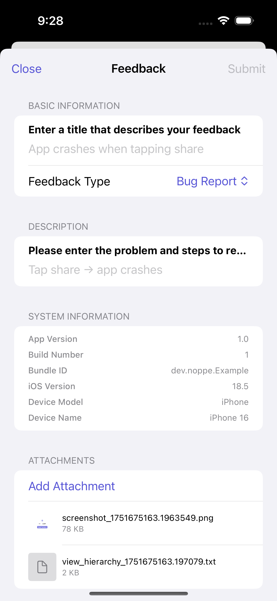

# FeedbackAssistant

A comprehensive Swift package for collecting user feedback in iOS apps with rich attachment support and automatic system information collection.

## Features

- 📝 **Easy-to-use feedback collection UI** - Native SwiftUI interface with clean, intuitive design
- 📸 **Automatic screenshot capture** - Capture current screen state with view hierarchy information
- 🗂️ **View hierarchy attachment** - Automatically attach UI debugging information
- 📋 **Multiple feedback types** - Bug Report, Feature Request, Performance Issue, Usability Issue, Other
- 📎 **Rich file attachment support** - Images, documents, and custom files with QuickLook preview
- ℹ️ **Automatic system information** - App version, device info, iOS version automatically collected
- 🌐 **Multi-language support** - English and Japanese localization with String Catalog
- 🎨 **Modern architecture** - Built with SwiftUI, Observation framework, and async/await
- 🔌 **Protocol-based submission** - Flexible integration with any backend service

## Installation

### Swift Package Manager

Add the following to your `Package.swift` file:

```swift
dependencies: [
    .package(url: "https://github.com/noppefoxwolf/FeedbackAssistant.git", from: "1.0.0")
]
```

Or add it through Xcode:
1. File → Add Package Dependencies
2. Enter the repository URL: `https://github.com/noppefoxwolf/FeedbackAssistant.git`

## Usage

### Basic Setup

```swift
import SwiftUI
import FeedbackAssistantUI
import FeedbackAssistant

struct ContentView: View {
    @State private var showingFeedback = false
    
    var body: some View {
        VStack {
            Button("Show Feedback") {
                showingFeedback = true
            }
        }
        .sheet(isPresented: $showingFeedback) {
            FeedbackAssistantView(
                submissionHandler: YourFeedbackSubmissionHandler()
            )
        }
    }
}
```

### With Automatic Screenshot and View Hierarchy

```swift
import SwiftUI
import FeedbackAssistantUI
import FeedbackAssistant

struct ContentView: View {
    @State private var showingFeedback = false
    
    var body: some View {
        VStack {
            Button("Send Feedback") {
                showingFeedback = true
            }
        }
        .sheet(isPresented: $showingFeedback) {
            FeedbackAssistantView(
                submissionHandler: YourFeedbackSubmissionHandler(),
                initialIssue: createIssueWithAttachments()
            )
        }
    }
    
    private func createIssueWithAttachments() -> Issue {
        var attachments: [Attachment] = []
        
        // Add screenshot
        if let screenshotAttachment = captureScreenshotAttachment() {
            attachments.append(screenshotAttachment)
        }
        
        // Add view hierarchy
        if let hierarchyAttachment = viewHierarchyAttachment() {
            attachments.append(hierarchyAttachment)
        }
        
        return Issue(attachments: attachments)
    }
    
    private func captureScreenshotAttachment() -> Attachment? {
        guard let windowScene = UIApplication.shared.connectedScenes.first as? UIWindowScene,
              let window = windowScene.windows.first else {
            return nil
        }
        
        let renderer = UIGraphicsImageRenderer(bounds: window.bounds)
        let image = renderer.image { context in
            window.layer.render(in: context.cgContext)
        }
        
        guard let imageData = image.pngData() else {
            return nil
        }
        
        return Attachment(
            name: "screenshot_\(Date().timeIntervalSince1970).png",
            data: imageData,
            contentType: .png
        )
    }
    
    private func viewHierarchyAttachment() -> Attachment? {
        guard let windowScene = UIApplication.shared.connectedScenes.first as? UIWindowScene,
              let window = windowScene.windows.first else {
            return nil
        }
        
        let hierarchyDescription = window.perform(Selector(("recursiveDescription")))?.takeUnretainedValue() as? String ?? "Unable to get view hierarchy"
        let hierarchyData = hierarchyDescription.data(using: String.Encoding.utf8) ?? Data()
        
        return Attachment(
            name: "view_hierarchy_\(Date().timeIntervalSince1970).txt",
            data: hierarchyData,
            contentType: .plainText
        )
    }
}
```

### Custom Submission Handler

Implement the `FeedbackSubmissionProtocol` to handle feedback submission:

```swift
import FeedbackAssistant

class YourFeedbackSubmissionHandler: FeedbackSubmissionProtocol {
    func submitFeedback(_ issue: Issue) async throws {
        // Submit feedback to your backend service
        // Handle the issue data, attachments, etc.
        print("Submitting feedback: \(issue.title)")
        
        // Example: Send to your API
        try await sendToAPI(issue)
    }
    
    private func sendToAPI(_ issue: Issue) async throws {
        // Your API implementation
    }
}
```

## Components

### FeedbackAssistantView

The main UI component for collecting feedback with a modern SwiftUI interface.

**Parameters:**
- `submissionHandler`: Object conforming to `FeedbackSubmissionProtocol`
- `initialIssue`: Pre-populated issue data (optional)

**Features:**
- Form fields for title and description
- Feedback type picker (Bug Report, Feature Request, Performance Issue, Usability Issue, Other)
- System information display (app version, device info, iOS version)
- Attachment management with QuickLook preview
- Multi-language support

### Issue

Data model representing a feedback issue with automatic system information collection.

**Properties:**
- `title`: Issue title
- `description`: Detailed description  
- `type`: Feedback type (FeedbackType enum)
- `attachments`: Array of file attachments
- `systemInfo`: Automatically collected system information
- `createdAt`/`updatedAt`: Timestamps

### Attachment

Data model for file attachments with rich content type support.

**Properties:**
- `name`: File name
- `data`: File data
- `contentType`: UTType of the file
- `createdAt`: Creation timestamp
- `fileSize`: Computed property for human-readable file size
- `isImage`/`isText`: Convenience properties for content type checking

### SystemInfo

Automatically collected system information.

**Properties:**
- `appVersion`: App version from CFBundleShortVersionString
- `appBuildNumber`: Build number from CFBundleVersion
- `bundleIdentifier`: App bundle identifier
- `systemVersion`: iOS version
- `deviceModel`: Device model (iPhone, iPad, etc.)
- `deviceName`: User-assigned device name
- `systemName`: OS name (iOS, iPadOS)

### FeedbackType

Enumeration of available feedback types with localized titles.

**Cases:**
- `.bug`: Bug Report
- `.featureRequest`: Feature Request  
- `.performance`: Performance Issue
- `.usability`: Usability Issue
- `.other`: Other

## Localization

FeedbackAssistant supports multiple languages through String Catalog:

- **English** (default)
- **Japanese** (日本語)

To add support for additional languages, add translations to the String Catalog files:
- `Sources/FeedbackAssistant/Resources/Localizable.xcstrings` 
- `Sources/FeedbackAssistantUI/Resources/Localizable.xcstrings`

## Architecture

Built with modern iOS development practices:

- **SwiftUI**: Native declarative UI framework
- **Observation**: Modern reactive programming with `@Observable`
- **Async/Await**: Asynchronous submission handling
- **Protocol-Oriented**: Flexible submission handling
- **String Catalog**: Modern localization approach
- **QuickLook**: Native file preview functionality

## Example App

Check out the `Example.swiftpm` folder for a complete example implementation that demonstrates:
- Automatic screenshot capture
- View hierarchy attachment  
- Custom submission handling
- Japanese localization

## Requirements

- iOS 17.0+
- Swift 6.0+
- Xcode 16.0+

## License

MIT License. See [LICENSE](LICENSE) for details.

## Contributing

Contributions are welcome! Please feel free to submit a Pull Request.

## Screenshots



*Modern SwiftUI interface with automatic screenshot capture and system information collection*